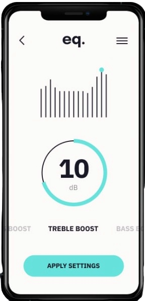

# equalizer-landing-page  
# 🎧 Premium Music Equalizer Landing Page  



## 📖 About the Project  
A modern, high-end landing page designed to showcase a **Premium Mobile Audio Equalizer App**.  
The page highlights the app’s features such as advanced EQ controls, treble & bass customization, volume mixing, and spatial audio enhancements — all wrapped in a clean, stylish UI with abstract decorative shapes.

---

## 🌐 Live Demo  
🔗 **Live Preview:** https://mohammed-004del.github.io/mohamed-webdev-Equalizer_App/

---

## 🛠️ Tech Stack  
  

  

---

## 📂 Features  
- ✅ **Smooth and Modern UI Layout**  
- ✅ **Fully Responsive Design** (Mobile → Desktop)  
- ✅ **Premium App Mockup Display**  
- ✅ **Subscription Section ($4/month)**  
- ✅ **iOS & Android Download Buttons**  
- ✅ **Custom Decorative Abstract Shapes for Visual Depth**  
- ✅ **Clean Code Structure & Simple File Organization**

---

## 📸 Screenshot  


---

## 📁 Folder Structure  
```
equalizer-landing-page/
├── index.html          # Main HTML structure
├── style.css           # Styling with responsive design
└── images/             # Images folder
    └── eq-image.jpg    # Phone mockup image

```

---

## ⚙️ Installation  
Clone the repository:  
```bash
git clone https://github.com/Mohammed-004del/mohamed-webdev-Equalizer_App.git
```

Open the project locally:  
```bash
cd equalizer-landing-page
```

Run in any browser:  
```
open index.html
```

---

## 🙌 Author  
Developed by **Mohammed Mahmood**  
Feel free to use this project as a landing page template or UI portfolio piece.

---

## 📜 License  
This project is available for **personal & educational use**.  
Commercial use requires permission.
